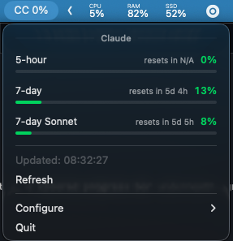

# CC Usage Tracker

A macOS menu bar app that shows your Claude API usage at a glance.



## Features

- **Live usage in the menu bar** — shows your 5-hour utilization as `CC 66%`
- **Colored progress bars** — green under 70%, orange at 70-90%, red above 90%
- **All rate limits** — 5-hour, 7-day, 7-day per model (Sonnet, Opus, etc.)
- **Reset countdown** — see when each limit resets
- **Auto-refreshes** every 5 minutes, with manual refresh available
- **Automatic setup** — extracts your session cookie from the browser, no copy-pasting needed
- **Secure** — session key stored in macOS Keychain, never in a plaintext file
- **Auto cookie refresh** — re-extracts from the browser on session expiry (401)

## Requirements

- macOS
- Python 3.10+
- A [Claude Pro/Team](https://claude.ai) account
- Brave, Chrome, Chromium, or Firefox with an active claude.ai session

## Install

```bash
git clone https://github.com/yourusername/cc-usage-tracker.git
cd cc-usage-tracker
python3 -m venv .venv
source .venv/bin/activate
pip install -r requirements.txt
```

## Run

```bash
source .venv/bin/activate
python app.py
```

On first launch a setup dialog walks you through connecting your account:

1. Click **"Set Up Automatically"**
2. Confirm your browser (Brave is the default)
3. macOS will prompt you to allow Keychain access — click **"Always Allow"** so it doesn't ask again
4. Done. The app auto-discovers your organization and starts tracking.

## How it works

The app reads your `sessionKey` cookie from the browser and calls the same usage API that the [claude.ai settings page](https://claude.ai/settings/usage) uses:

```
GET https://claude.ai/api/organizations/{org_id}/usage
```

No data is sent anywhere except to `claude.ai` to check your usage.

### What's stored where

| Data | Location | Protection |
|---|---|---|
| Session cookie | macOS Keychain | Encrypted, requires password / Touch ID |
| Org ID, browser preference | `~/.config/cc-usage-tracker/config.json` | Non-sensitive only |

## Configuration

All configuration is available from the menu bar dropdown under **Configure > Claude**:

- **Auto Setup** — re-run the automatic cookie extraction and org discovery
- **Refresh Cookie** — re-extract the cookie without full re-setup (useful if your session expired)
- **Manual Setup** — enter org ID and session key by hand

## Adding providers

The app is built with a provider pattern so other services can be added. To add a new provider:

1. Create `providers/yourservice.py` subclassing `BaseProvider`
2. Implement `fetch()`, `is_configured()`, `get_config_fields()`, `apply_config()`, `to_dict()`
3. Register it in the `self.providers` list in `app.py`

The menu bar will show multiple providers side by side: `CC 30% · OAI 45%`

## Project structure

```
cc-usage-tracker/
├── app.py               # Menu bar app, config, refresh logic
├── views.py             # Custom AppKit views (progress bars, headers)
├── providers/
│   ├── __init__.py      # BaseProvider, UsageMetric, ProviderStatus
│   └── claude.py        # Claude provider (API, cookie extraction, Keychain)
├── requirements.txt
└── setup.sh
```

## License

MIT
